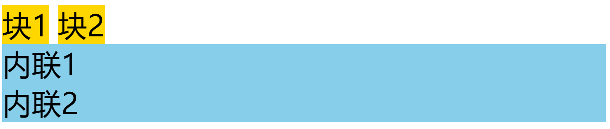
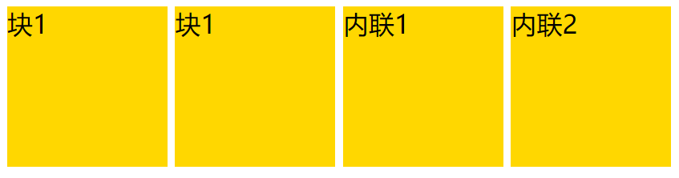
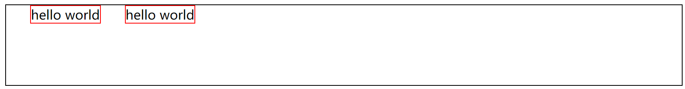
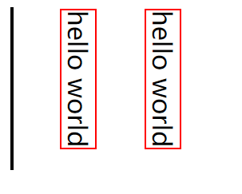
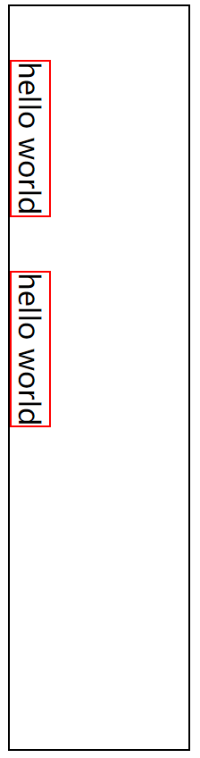
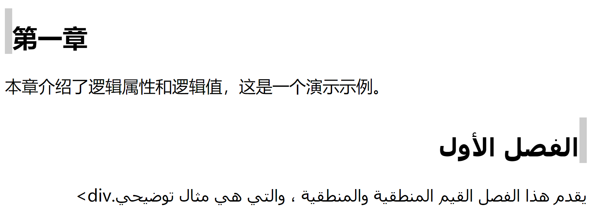
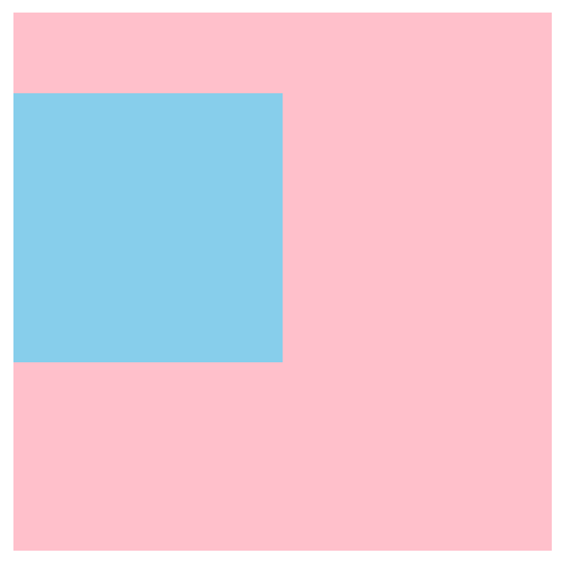
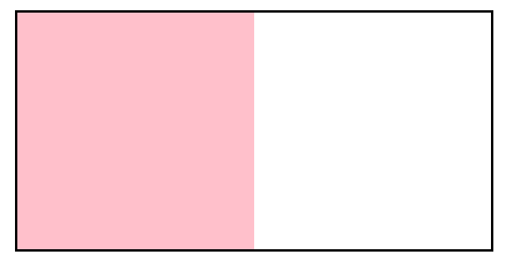
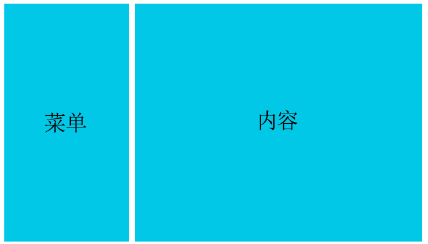

# CSS基础

[TOC]

# 一、详解display属性

## 1.1、display属性的作用

在CSS中`display`属性表示“显示框类型”，即不同的盒模型。简单来说，可以把块级盒子转成内联盒子，也可以把内联盒子转成块级盒子。

```html
<style>
    .box1 {display:inline; background:gold;}
    .box2 {display:block; background:skyblue;}
</style>
<div class="box1">块1</div>
<div class="box1">块2</div>
<span class="box2">内联1</span>
<span class="box2">内联2</span>
```



<center><font color="red">（该图是基于google渲染结果放大5倍的截图）</font></center>

可以看到，div具备了内联盒子的特性，而span则具备了块级盒子的特性。当然`display`远比这些复杂的多，如弹性布局、网格布局等都是跟`display`有着紧密关系。


## 1.2、display属性分类：

- display

  - display-outside（外部值）
  - display-inside（内部值）
  - display-listitem（列表值）
  - display-internal（属性值）

  - display-box（显示值）
  - display-legacy（混合值）
  - global（全局值）

### display-outside（外部值）

外部值就是定义自身元素的外部表现，而不影响其内的子元素。

- `block`：表示块级盒子，比如`p`、`div`等标签默认就是块级盒子。
- `inline`：表示内联盒子，比如`span`、`i`等默认就是内联盒子。
- `run-in`：实验性质的属性，浏览器支持不好。

### display-inside（内部值）

和外部值相反，内部值就是定义子元素布局的。像`flex`、`grid`这些设置都会影响到子元素的布局形式。

- `flow-root`：一个BFC的块级盒子。
- `table`：带有内部表格布局的块级盒子。

- `flex`：带有内部弹性布局的块级盒子。
- `grid`：带有内部网格布局的块级盒子。

### display-listitem（列表值）

`list-item`属性值是一个 <font color=red>容纳内容</font> 和 <font color=red>单独的列表行内元素盒</font> 的块级盒子，目的是为了用div去代替

- 标签之类的
- 元素默认就是`list-item`

### display-internal（属性值）

- `table-row-group`
- `table-header-group`
- `table-footer-group`

- `table-row`
- `table-cell`
- `table-column-group`
- `table-column`
- `table-caption`
- `ruby-base`
- `ruby-text`
- `ruby-base-container`
- `ruby-text-container`

一些和`table`布局、`ruby`搭配一起控制页面布局的属性值，较少使用。

### display-box（显示值）

- `contents`：只影响其内容的样式生效，比如：字体大小、文字颜色等；但是像背景色、边框是不会生效的。
- `none`：从盒子树中移除，包括其所有后代元素。

### display-legacy（混合值）

- `inline-block`：对外表现成内联盒子，对内表现成块级盒子。
- `inline-table`：对外表现成内联盒子，对子元素表现成表格盒子。
- `inline-flex`：对外表现成内联盒子，对子元素表现成弹性盒子。
- `inline-grid`：对外表现成内联盒子，对子元素表现成网格盒子。


```html
<style>
    .box {display:inline-block; width:100px; height:100px; background: gold;}
</style>
<div class="box">块1</div>
<div class="box">块1</div>
<span class="box">内联1</span>
<span class="box">内联2</span>
```



<center><font color="red">（该图是基于google渲染结果放大2倍的截图）</font></center>

可以看到，盒子即具备了块级盒子的特性（支持宽高）又具备了内联盒子的特性（横向排列）。

### global（全局值）

- `inherit`：继承父元素的display属性。
- `initial`：不管父元素怎么设定，恢复到浏览器最初始的display属性。
- `unset`：unset混合了`inherit`和`initial`。如果父元素设置了，就用父元素的设定；如果父元素没有设置，就使用浏览器的缺省设定。


# 二、书写模式与逻辑属性

## 1.1、书写模式

绝大多数郭家的阅读方式都是从左到右进行的，但是也有一小部分郭家的阅读方式，可能是从右向左或从上到下。比如阿拉伯国家就是从右向左进行阅读的，所以在网页排版时，就要考虑这个情况，尤其是做国际站的同学们。


<center><font color="red">（该图是沙特阿拉伯政府截图）</font></center>

书写模式即`writing-mode`属性，可以帮助以上下阅读的国家去展示网页内容。它定义了文本水平或垂直排布以及在块级元素中文本的行进方向。

可选值有：

- `horizontal-tb`：水平方向自上而下的书写方式。
- `vertical-lr`：垂直方向自上左而下右的书写方式。
- `vertical-rl`：垂直方向自上右而下左的书写方式。
- `sideways-lr`：内容垂直方向从下左到上右的排列。

- `sideways-rl`：内容垂直方向从上右到下左排列。


<center><font color="red">（writing-mode属性）</font></center>

**注：目前`sideways-lr`和`sideways-rl`的兼容性并不是很好。**

## 1.2、逻辑属性

如果一套代码想实现国际化，处理不同国家的排版方式时，就会导致无法实现。代码如下：

```html
<style>
    body {
        border: 1px black solid;
        height: 100px;
    }

    div {
        border: 1px red solid;
        float: left;
        margin-left: 30px;
    }
</style>
<div>hello world</div>
<div>hello world</div>
```



<center><font color="red">（该图是基于google渲染结果放大2倍的截图：从左到右阅读）</font></center>

接下来给body添加垂直方向自左而右的书写方式，可以发现布局出现了混乱，height属性依然只针对高度，而margin-left属性也依然只针对左间距。

```html
<style>
    body {
        border: 1px black solid;
        height: 100px;
        writing-mode: vertical-lr; /*新增样式*/
    }

    div {
        border: 1px red solid;
        float: left;
        margin-left: 30px;
    }
</style>
<div>hello world</div>
<div>hello world</div>
```



<center><font color="red">（该图是基于google渲染结果放大2倍的截图：垂直方向从上左到下右阅读）</font></center>

那么如何更好的处理不同的书写模式呢？就要配合逻辑属性了。逻辑属性是从逻辑角度控制布局，而不是从物理、方向或维度来控制。

简单来说，物理属性和值指的是`width`、`height`、`left`、`top`、`right`、`bottom`等值；而逻辑属性和值指的是`start`、`end`、`inline-end`、`block-start`、`block-end`等值。其中block表示垂直方向，`inline`表示水平方式，在不同的书写模式下，`block`和`inline`锁代表的方向是会发生变化的。

下面用逻辑属性和值修改一下之前代码中出现的问题。

```html
<style>
    body {
        border: 1px black solid;
        block-size: 100px; /*修改样式 height: 100px;*/
        writing-mode: vertical-lr;
    }

    div {
        border: 1px red solid;
        float: left;
        margin-inline-start: 30px; /*修改样式 margin-left: 30px;*/
    }
</style>
<div>hello world</div>
<div>hello world</div>
```



<center><font color="red">（该图是基于google渲染结果放大2倍的截图：垂直方向从上左到下右阅读）</font></center>

下面再举一个例子：

```html
<style>
    section {
        text-align: start; /*start 逻辑值*/
    }

    h2 {
        border-inline-start: .3em solid #ccc; /*border-inline-start 逻辑属性*/
        padding-block-start: .5em; /*padding-inline-start 逻辑属性*/
    }
</style>
<section dir="auto">
    <h2>第一章</h2>
    <div>本章介绍了逻辑属性和逻辑值，这是一个演示示例。</div>
</section>
<section dir="auto">
    <h2>الفصل الأول</h2>
    <div>يقدم هذا الفصل القيم المنطقية والمنطقية ، والتي هي مثال توضيحي.div></div>
</section>
```



<center><font color="red">（该图是基于google渲染结果放大3倍的截图：逻辑属性案例）</font></center>

**注：dir属性可以设置元素的显示方向，是从左往右(ltr)，还是从右往左（rtl），当设置auto时会自动根据当前语言决定排列方向，dir属性非常适合那些从右向左进行阅读的国家，例如：阿拉伯语，波斯语，希伯来语等。**


# 三、BFC块级格式化上下文

## 1.1、BFC概念

BFC即Block Formatting Contexts（块级格式化上下文），它是W3C CSS2.1规范中的一个概念。它是页面中的一块渲染规则，它决定了其子元素将如何定位，以及和其他元素的关系和相互作用。

具有BFC特性的元素可以看作是隔离了的独立容器，容器里面的元素不会在布局上影响到外面的元素，并且BFC具有普通容器所没有的一些特性。

通俗一点来讲，可以把BFC理解为一个封闭的大箱子，箱子内部的元素无论如何翻江倒海，都不会影响到外部。


## 1.2、BFC触发条件

满足以下条件之一，即可触发BFC：

- float的值不是none
- position的值不是static或者relative
- display的值是inline-block、table-cell、flex、table-caption或者inline-flex
- overflow的值不是visible

下面的box盒子就是一个BFC独立容器：

```css
.box {
	width: 100px;
	height: 100px;
	overflow: hidden; /*触发了BFC，形成独立盒子*/
}
```


## 1.3、BFC的应用

在前面介绍盒模型的margin时，出现了传递和叠加的问题，这里可以采用BFC规范来解决，原理就是让盒子形成一个独立的容器，无论里面的子元素如何折腾，都不影响外面的元素。

```html
<style>
    .box1 {
        width: 200px;
        height: 200px;
        background: pink;
        overflow: hidden; /*触发了BFC，形成独立盒子*/
    }

    .box2 {
        width: 100px;
        height: 100px;
        background: skyblue;
        margin-top: 30px;
    }
</style>
<div class="box1">
    <div class="box2"></div>
</div>
```



<center><font color="red">（该图是基于google渲染结果放大3倍的截图：BFC解决叠加问题）</font></center>

BFC还可以解决前面浮动遇到了父容器高度塌陷的问题，也就是不管里面子元素是否浮动，都不会因为脱离文档流对容器高度造成影响。


```html
<style>
    .box1 {
        width: 200px;
        border: 1px black solid;
        overflow: hidden; /*触发了BFC，形成独立盒子*/
    }

    .box2 {
        width: 100px;
        height: 100px;
        background: pink;
        float: left;
    }
</style>
<div class="box1">
    <div class="box2"></div>
</div>
```



<center><font color="red">（该图是基于google渲染结果放大3倍的截图：BFC解决浮动高度塌陷）</font></center>

在现代布局flex和grid中，是默认自带BFC规范的，所以可以解决非BFC盒子的一些问题，这就是为什么flex和grid能成为更好的布局方式原因之一。


# 四、标签默认样式及清除

## 1.1、标签默认样式

一些HTML标签在浏览器中会有默认样式，

例如：`body`标签会有`margin:8px;` `ul`标签会有`margin:16px 0;`及`padding-left:40px;`。

当我们在切图软件中进行尺寸或位置测量的时候，把测量出来的数值设置到对应的标签上时，可能会受到当前标签默认样式的影响，从而页面显示效果跟设计图效果不符。

## 1.2、清除默认样式

通常在网页开发中，要去掉这些影响尺寸和位置的默认样式及其他影响布局的默认值。可以参考[CSS Tools:Reset CSS](https://meyerweb.com/eric/tools/css/reset/)方案。

```css
html, body, div, span, applet, object, iframe,
h1, h2, h3, h4, h5, h6, p, blockquote, pre,
a, abbr, acronym, address, big, cite, code,
del, dfn, em, img, ins, kbd, q, s, samp,
small, strike, strong, sub, sup, tt, var,
b, u, i, center,
dl, dt, dd, ol, ul, li,
fieldset, form, label, legend,
table, caption, tbody, tfoot, thead, tr, th, td,
article, aside, canvas, details, embed, 
figure, figcaption, footer, header, hgroup, 
menu, nav, output, ruby, section, summary,
time, mark, audio, video {
	margin: 0;
	padding: 0;
	border: 0;
	font-size: 100%;
	font: inherit;
	vertical-align: baseline;
}
/* HTML5 display-role reset for older browsers */
article, aside, details, figcaption, figure, 
footer, header, hgroup, menu, nav, section {
	display: block;
}
body {
	line-height: 1;
}
ol, ul {
	list-style: none;
}
blockquote, q {
	quotes: none;
}
blockquote:before, blockquote:after,
q:before, q:after {
	content: '';
	content: none;
}
table {
	border-collapse: collapse;
	border-spacing: 0;
}
```

由于Reset CSS相对”暴力“，不管你有没有用，统统重置成一样的效果，且影响的范围很大，所以更加”平和“的一种方式 [Normalize CSS](https://github.com/necolas/normalize.css/blob/master/normalize.css) 诞生了。

Normalize CSS可以看成是一种Reset CSS的替代方案。创造Normalize CSS有下面这几个目的：

- 保护有用的浏览器默认样式而不是完全去掉它们
- 一般化的样式：为大部分HTML元素提供
- 修复浏览器自身的bug并保证各浏览器的一致性
- 优化CSS可用性：用一些小技巧
- 解释代码：用注释和详细的文档

```css
html {
  line-height: 1.15; /* 1 */
  -webkit-text-size-adjust: 100%; /* 2 */
}
body {
  margin: 0;
}
main {
  display: block;
}
h1 {
  font-size: 2em;
  margin: 0.67em 0;
}
hr {
  box-sizing: content-box; /* 1 */
  height: 0; /* 1 */
  overflow: visible; /* 2 */
}
pre {
  font-family: monospace, monospace; /* 1 */
  font-size: 1em; /* 2 */
}
a {
  background-color: transparent;
}
abbr[title] {
  border-bottom: none; /* 1 */
  text-decoration: underline; /* 2 */
  text-decoration: underline dotted; /* 2 */
}
b,
strong {
  font-weight: bolder;
}
code,
kbd,
samp {
  font-family: monospace, monospace; /* 1 */
  font-size: 1em; /* 2 */
}
small {
  font-size: 80%;
}
sub,
sup {
  font-size: 75%;
  line-height: 0;
  position: relative;
  vertical-align: baseline;
}
sub {
  bottom: -0.25em;
}
sup {
  top: -0.5em;
}
img {
  border-style: none;
}
button,
input,
optgroup,
select,
textarea {
  font-family: inherit; /* 1 */
  font-size: 100%; /* 1 */
  line-height: 1.15; /* 1 */
  margin: 0; /* 2 */
}
button,
input { /* 1 */
  overflow: visible;
}
button,
select { /* 1 */
  text-transform: none;
}
button,
[type="button"],
[type="reset"],
[type="submit"] {
  -webkit-appearance: button;
}
button::-moz-focus-inner,
[type="button"]::-moz-focus-inner,
[type="reset"]::-moz-focus-inner,
[type="submit"]::-moz-focus-inner {
  border-style: none;
  padding: 0;
}
button:-moz-focusring,
[type="button"]:-moz-focusring,
[type="reset"]:-moz-focusring,
[type="submit"]:-moz-focusring {
  outline: 1px dotted ButtonText;
}
fieldset {
  padding: 0.35em 0.75em 0.625em;
}
legend {
  box-sizing: border-box; /* 1 */
  color: inherit; /* 2 */
  display: table; /* 1 */
  max-width: 100%; /* 1 */
  padding: 0; /* 3 */
  white-space: normal; /* 1 */
}
progress {
  vertical-align: baseline;
}
textarea {
  overflow: auto;
}
[type="checkbox"],
[type="radio"] {
  box-sizing: border-box; /* 1 */
  padding: 0; /* 2 */
}
[type="number"]::-webkit-inner-spin-button,
[type="number"]::-webkit-outer-spin-button {
  height: auto;
}
[type="search"] {
  -webkit-appearance: textfield; /* 1 */
  outline-offset: -2px; /* 2 */
}
[type="search"]::-webkit-search-decoration {
  -webkit-appearance: none;
}
::-webkit-file-upload-button {
  -webkit-appearance: button; /* 1 */
  font: inherit; /* 2 */
}
details {
  display: block;
}
summary {
  display: list-item;
}
template {
  display: none;
}
[hidden] {
  display: none;
}
```

采用Normalize CSS和Reset CSS结合代码，形成一个更加强大的方案，文件命名为`reset.css`，代码如下：

```css
@charset "utf-8";

/* --------------------重置样式-------------------------------- */

body,
h1,
h2,
h3,
h4,
h5,
h6,
hr,
p,
blockquote,
dl,
dt,
dd,
ul,
ol,
li,
button,
input,
textarea,
th,
td {
    margin : 0;
    padding: 0
}

/*设置默认字体*/
body {
    font-size  : 14px;
    font-style : normal;
    font-family: -apple-system, BlinkMacSystemFont, segoe ui, Roboto, helvetica neue, Arial, noto sans, sans-serif, apple color emoji, segoe ui emoji, segoe ui symbol, noto color emoji;
}

/*字体太小用户体检不好，让small恢复12px*/
small {
    font-size: 12px
}

h1 {
    font-size: 18px
}

h2 {
    font-size: 16px
}

h3 {
    font-size: 14px
}

h4,
h5,
h6 {
    font-size: 100%
}

ul,
ol {
    list-style: none
}

a {
    text-decoration : none;
    background-color: transparent
}

a:hover,
a:active {
    outline-width  : 0;
    text-decoration: none
}

/*重置表格*/
table {
    border-collapse: collapse;
    border-spacing : 0
}

/*重置hr*/
hr {
    border: 0;
    height: 1px
}

/*图形图片*/
img {
    border-style: none
}

img:not([src]) {
    display: none
}

svg:not(:root) {
    overflow: hidden
}

/*下面的操作是针对于html5页面布局准备的，不支持ie6~8以及其他低版本的浏览器*/
html {
    /*禁用系统默认菜单*/
    -webkit-touch-callout   : none;
    /*关闭iphone & Android的浏览器纵向和横向模式中自动调整字体大小的功能*/
    -webkit-text-size-adjust: 100%
}

input,
textarea,
button,
a {
    /*表单或者a标签在手机点击时会出现边框或彩色的背景区域，意思是去除点击背景框*/
    -webkit-tap-highlight-color: rgba(0, 0, 0, 0)
}

/*重置html5元素的默认样式*/
article,
aside,
details,
figcaption,
figure,
footer,
header,
main,
menu,
nav,
section,
summary {
    display: block
}

audio,
canvas,
progress,
video {
    display: inline-block
}

audio:not([controls]),
video:not([controls]) {
    display: none;
    height : 0
}

progress {
    vertical-align: baseline
}

mark {
    background-color: #ff0;
    color           : #000
}

sub,
sup {
    position      : relative;
    font-size     : 75%;
    line-height   : 0;
    vertical-align: baseline
}

sub {
    bottom: -0.25em
}

sup {
    top: -0.5em
}

button,
input,
select,
textarea {
    font-size: 100%;
    outline  : 0
}

button,
input {
    overflow: visible
}

button,
select {
    text-transform: none
}

textarea {
    overflow: auto
}

button,
html [type="button"],
[type="reset"],
[type="submit"] {
    -webkit-appearance: button
}

button::-moz-focus-inner,
[type="button"]::-moz-focus-inner,
[type="reset"]::-moz-focus-inner,
[type="submit"]::-moz-focus-inner {
    border-style: none;
    padding     : 0
}

button:-moz-focusring,
[type="button"]:-moz-focusring,
[type="reset"]:-moz-focusring,
[type="submit"]:-moz-focusring {
    outline: 1px dotted ButtonText
}

[type="checkbox"],
[type="radio"] {
    box-sizing: border-box;
    padding   : 0
}

[type="number"]::-webkit-inner-spin-button,
[type="number"]::-webkit-outer-spin-button {
    height: auto
}

[type="search"] {
    -webkit-appearance: textfield;
    outline-offset    : -2px
}

[type="search"]::-webkit-search-cancel-button,
[type="search"]::-webkit-search-decoration {
    -webkit-appearance: none
}

::-webkit-input-placeholder {
    color  : inherit;
    opacity: .54
}

::-webkit-file-upload-button {
    -webkit-appearance: button;
    font              : inherit
}
```


# 五、CSS文件划分及功能分类

## 1.1、CSS文件划分

在中大型项目中，一般会对CSS进行文件划分，根据文件的性质与用途，大概会分成：

- 公共型样式

- 特殊型样式
- 皮肤型样式


​		公共型样式可命名为global.css或common.css等名字，主要包括网站通用样式编写，例如：重置默认样式reset、网站通用布局、通用模块和元件、通用响应式系统等。


​		特殊型样式主要是根据当前页面来决定的文件，只针对当前页面做出特殊处理的 样式，例如只在首页中用到的样式可以放置到index.css中，在登录页中用到的样式可放置到login.css中。


​		皮肤型样式是针对网站需要皮肤功能时，把颜色、背景等抽离出来放到文件中的形式，例如theme-pink.css、theme-skyblue.css等。


CSS文件的引入顺序如下：

```html
<link href="assets/css/global.css" rel="stylesheet" type="text/css"/>
<link href="assets/css/index.css" rel="stylesheet" type="text/css"/>
<link href="assets/css/theme.css" rel="stylesheet" type="text/css"/>
```


## 1.2、CSS功能分类

上面提到了公共型样式，在文件中具体包含哪些常见的功能呢？大概可分为如下几类：

- 重置样式
- 网站通用布局
- 通用模块
  - 通用模块指的是网页中可以重复使用的较大的整体，比如导航、登录、注册、各种列表、评论、搜索等。
- 通用元件
  - 通用原件指的是不可再分的较为小巧的个体，通常被重复用于各种模块中，比如按钮、输入框、loading、图标等。
- 通用响应式系统
  - 通用响应式系统指的是在不同设备下要实现响应式布局，当满足了某个断点设定后调用的相应变化样式，比如浮动添加、栅格生效、显示隐藏、版心宽度等。


​		重置样式在前面章节中有介绍过，主要是去除默认样式和统一不同设备下的表现形态。通常为Reset CSS代码和Normalize CSS代码的结合版本。在本套课程中已经把二者结合成为了一个reset.css文件，并在多个综合案例中进行使用过。


  网站通用布局主要指的是对网站中出现的大块结构进行排版。如：PC端中的菜单、内容的左右布局方案；移动端中的头部、列表、尾部的上中下布局方案等。




<center><font color="red">菜单、内容的左右布局</font></center>


<center><font color="red">头部、列表、尾部的上中下布局</font></center>


# 六、CSS方法论及样式规范

## 1.1、CSS方法论

  方法论是一个哲学术语，会对一系列具体的方法进行分析研究、系统总结并最终提出较为一般性的原则。CSS方法论是一种面向CSS、由个人和组织设计、已被诸多项目检验且公认有效的最佳实践。这些方法论都会涉及结构化的命名约定，并且在组织CSS时可提供相应的指南，从而提升代码的性能、可读性以及可维护性。(引自：[前端躬行记](https://www.kancloud.cn/pwstrick/fe-questions/1627447))

常见的CSS方法论有：

- OOCSS
- BEM
- SMACSS
- Atomic CSS


我们的实战项目主要采用 BEM + SMACSS 这两种方法论的结合命名约定，所以下面对这两种方法论进行简单介绍。

BEM（Block Element Modifier）是指块级元素修饰符，BEM分为三部分：

1、块（Block）是一个独立实体，最高级抽象，例如菜单、文本框等。

2、元素（Element）是块的组成部分，被包含在块中，无法自成一体，例如菜单项、标题等。

3、修饰符（Modifier）是块或元素的状态，可更改他们的外观或行为，例如高亮、选中等。

​		BEM中的块、元素和修饰符需要全部小写，名称中的单词用连字符（-）分隔，元素由双下划线（__）分隔，修饰符由双连字符（--）分隔。注意，块和元素都既不能是HTML元素名或ID，也不能依赖其他块或元素。

```css
.setting-menu{}
.setting-menu--open{}
.setting-menu__head{}
.setting-menu__head--fixed{}
.setting-menu__content{}
```

​		上面代码中，`.setting-menu`表示一个独立实体，`.setting-menu__head`、`.setting-menu__content{}`表示独立实体的组成部分，`.setting-menu--open{}`是对配置菜单展开状态的一种行为描述，`.setting-menu__head--fixed{}`是对配置菜单头部固定状态的一种行为描述。


  SMACSS（Scalable and Modular Architecture for CSS）是指可伸缩及模块化的CSS架构，由Jonathan Snook在2011年雅虎工作时提出。他在OOCSS和BEM的基础上添加了五种类别的组件的处理规则，具体如下所列。

1、基础（Base）是为HTML元素定义默认样式，可以包含属性、伪类等选择器。

2、布局（Layout）会将页面分为几个部分，可作为高级容器包含一个或多个模块，例如左右分栏、栅格系统等。

3、模块（Module）又名对象或块，是可重用的模块化部分，例如导航栏、产品列表等。

4、状态（State）描述的是任一模块或布局在特定状态下的外观，例如隐藏、激活等。

5、主题（Theme）也就是换肤，描述了页面的外观，它可修改签名四个类别的样式，例如链接颜色、布局方式等。

​		通过相应的命名前缀来完成对类别的表示，`l-`用作布局的前缀，例如：`.l-inline`、`.layout-grid`等；`m-`模块命名前缀，例如：`.m-profile`、`.field`等；`is-`用作状态的前缀，例如：`.is-collapsed`、`.is-active`等；`theme-`用作主体的前缀，例如：`.theme-a-background`、`.theme-l-grid`等。

​	在实际工作中，不需要局限于某一个CSS方法论，有很多时候可以结合使用，共享模块化CSS的规则。例如遵循BEM的命名约定，以及SMACSS的分类前缀，具体如下列。

```css
.m-setting-menu{}
.m-setting-menu--open{}
.m-setting-menu__head{}
.m-setting-menu__head--fixed{}
.m-setting-menu__content{}
```


## 1.2、样式规范

1、使用类选择器，放弃ID选择器：ID在一个页面中的唯一性导致了如果以ID为选择器来写CSS，就无法重用。

2、命名应简约而不失语义：反对过长命名和没有语义的命名，如：`.m-navigation`、`.m-abc`，推荐：`.m-nav`。

3、相同语义的不同类命名：直接加数字或字母区分即可（如：`.m-list`、`.m-list2`、`.m-list3`等，都是列表模块，但是是完全不一样的模块）。

4、防止污染和被污染：为了防止后代选择器污染，尽量采用`>`方式，例如：`.m-nav>li`，而不是`.m-nav li`。

5、最后一个值也以分号结尾：通常在大括号结束前的值可以省略分号，但是这样做会对修改、添加和维护工作带来不必要的失误和麻烦。

6、省略值为0时的单位：为节省不必要的字节同时也使阅读方便，我们将0px、0em、0%等值缩写为0.

7、根据属性的重要性按顺序书写：先显示定位布局类属性，后盒模型等自身属性，最后是文本类及修饰类属性。例如：

```css
.m-box {
    position: relative;
    width: 600px;
    margin: 0 auto;
    text-align: center;
    color: #000;
}
```

8、CSS需要进行格式化和对齐处理：推荐vsCode插件：`formate: CSS/LESS/SCSS formatter`。


